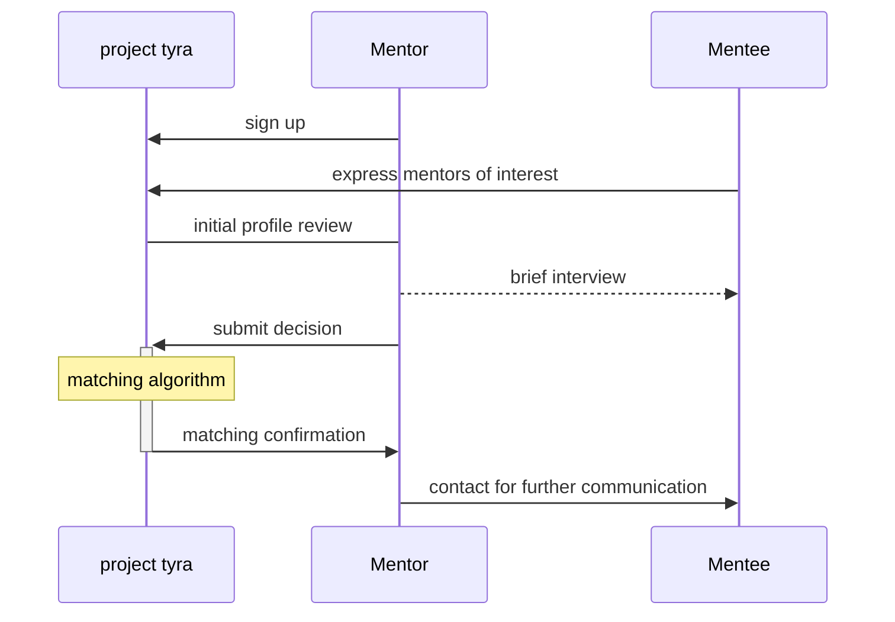

# Project Tyra MMP Mentor Dashboard

This project uses Streamlit to facilitate the screening process for the Mentor-Mentee Program (MMP) of Project Tyra.

In the first phase, implemented in `app_screening.py`, mentors can view the profiles of individuals interested in matching with them and express their preferences via a Google form. In the second phase, implemented in `app_matching_confirmation.py`, mentors can view the profiles of the mentees who have been matched with them.

## Setup

Mentor and mentee data are stored in Google Sheets, accessible to anyone with the link. These details are stored in `.streamlit/secrets.toml`, so when deployed on Streamlit Community Cloud, there is no need to modify the scripts, just finish the secret setup in during the deployment.
