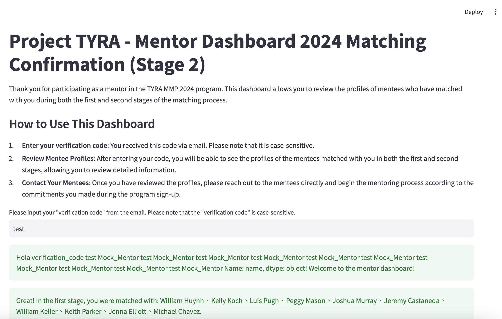
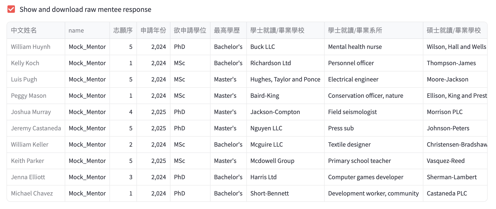
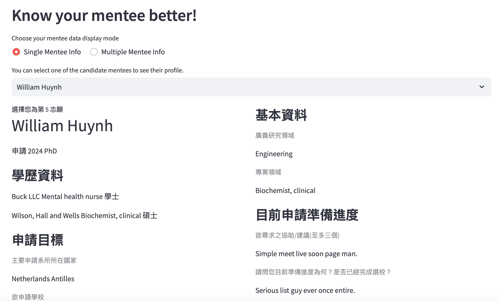
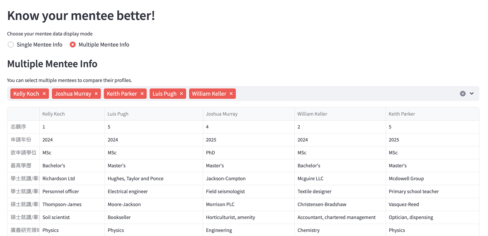

# Project Tyra MMP Mentor Dashboard

This project uses Streamlit to facilitate the screening and matching process for the Mentor-Mentee Program (MMP) of Project Tyra.

In the first phase, implemented in app_screening.py, mentors can view the profiles of individuals interested in matching with them and express their preferences via a Google Form. In the second phase, implemented in app_matching_confirmation.py, mentors can view the profiles of the mentees who have been matched with them.

    <a href="https://www.loom.com/share/086b4b11ba1542a58984ac8e408e4d2f">
      
Project Tyra Mentor Dashboard Overview 🚀 - Watch Video

    </a>
    

## MMP Program Overview

The MMP matching process consists of two phases: the initial profile review and the matching confirmation. This project simplifies the secure delivery of mentee information to mentors during these phases.

## How MMP Matching Works

## Features of the Mentor Dashboard

This mentor dashboard was developed with the primary goal of securely delivering mentee information to mentors with minimal friction. The dashboard is built using Streamlit for a streamlined, single-page frontend, with data managed in Google Sheets.

### Phase 1: Initial Profile Review

When mentors arrive at the webpage, they see clear instructions to get started. A unique verification code is sent to their email, which they must enter to access the dashboard. Once verified, mentors can:

* Download Data: Optionally download a CSV file containing the mentee information for offline access.

* View Profiles: See mentee information in a designed table format on the webpage.

* Side-by-Side Comparison: Use a comparison feature inspired by Apple’s product comparison layout to easily review multiple mentees at once.

### Phase 2: Matching Confirmation

After the matching algorithm completes its process, mentors can log in again to view the mentees matched with them. Mentors can then use the embedded Google Form to confirm their decisions or proceed with further steps.

This intuitive process ensures a seamless experience for mentors while maintaining the security and integrity of the data.

## Setup

Mentor and mentee data are stored in Google Sheets, accessible only via secure links. These links are stored in the .streamlit/secrets.toml file, which is configured during deployment. When deploying on Streamlit Community Cloud, no script modifications are necessary—just complete the secret setup as part of the deployment process.